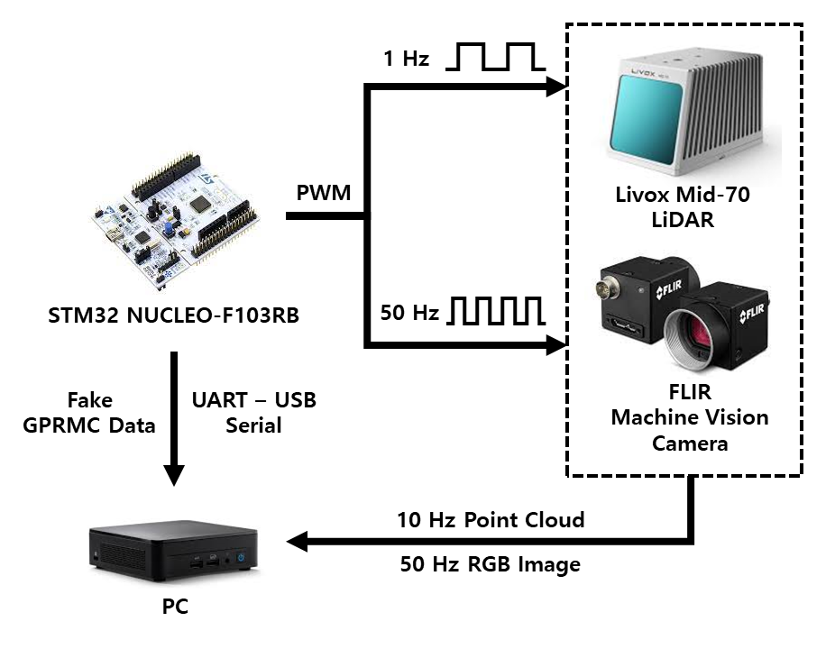
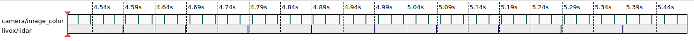
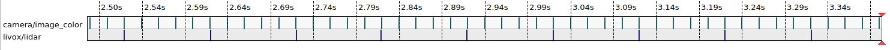

# CoCEL_Handheld_Software
Handheld device software pack. CoCEL @POSTECH  
## Features  
Synchronize LiDAR & Camera Frame.  

## Architecture
<p align="center"></p>  

## Synchronization Result  
**Before**  
<p align="center"></p>

**After**  
<p align="center"></p>

## Hard ware  
- [LiDAR: Mid-70](https://www.livoxtech.com/mid-70)
- [Camera: FLIR Machine vision camera](https://www.flir.com/products/blackfly-s-usb3/?vertical=machine%20vision&segment=iis)
- IMU

========================  

**Hardware Design will be uploaded**  
  
========================  

## Software  
- FLIR Camera Driver
- Livox LiDAR SDK
- Livox ROS Driver
- STM32 PWM Trigger

**!! Must Read !!**  
If you want synchronize LiDAR and Camera, you must use `livox_sdk`, `livox_ros_driver`, `flir_camera_driver` in this repository instead of original sdk and driver.  

**Download this repository**  
```bash
git clone https://github.com/SanghyunPark01/CoCEL_Handheld_Software.git
```

### Camera
**Hardware Setup**  
1. Prepare red and black Cable in FLIR Camera Sync Cable.  
2. Connect STM Board Timer Pin(Set to 50Hz) with red cable in FLIR Camera Sync Cable.  
3. Connect STM Board Ground Pin with black cable in FLIR Camera Sync Cable.  

**Download SDK**  
Download [Spinnaker SDK](https://www.flirkorea.com/products/spinnaker-sdk/) first.  

**Build ROS Package**  
Move `flir_camera_driver`(in this repo) **to your ros workspace**.
```bash
$ cd (your ros_workspace)
$ catkin_make
$ source (your ros_workspace)/devel/setup.bash
```  
**Run Proram**  
```
$ roslaunch spinnaker_camera_driver camera_trigger.launch
```

### LiDAR
**Hardware Setup**  
1. Prepare blue and black Cable in Livox Sync Cable.  
2. Connect STM Board Timer Pin(Set to 10Hz) with blue cable in Livox Sync Cable.  
3. Connect STM Board Ground Pin with black cable in Livox Sync Cable.  

**Build Livox SDK**  
build `livox_sdk` in this repository.
```bash
$ cd CoCEL_Handheld_Software/livox_sdk
$ cd build
$ cmake ..
$ make
$ sudo make install
```  

**Build Livox ROS Driver**  
Move `livox_ros_driver`(in this repo) **to your ros workspace**.
```bash
$ cd (your ros_workspace)
$ catkin_make
$ source (your ros_workspace)/devel/setup.bash
```  

**Run Program**  
Before run, you have to change some path.
- In `livox_ros_driver/launch/livox_lidar_trigger.launch`, you have to change parameter `path_for_time_stamp`.(Replace with your ros workspace path)  
- In `livox_ros_driver/config/livox_lidar_config.json`, you have to change parameter `device_name`.(Replace with your UART-USB serial port name)  

When you finish changing parameter, run roslaunch file.  
```bash
$ roslaunch livox_ros_driver livox_lidar_trigger.launch
```

### STM32  
1. Timer2: make 50Hz PWM.  
2. Timer3: make 10Hz PWM & UART Transmit fake GPRMC data.  

Source Code in `cocel_handheld_trigger`

## Reference
[1. LIV_handhold](https://github.com/sheng00125/LIV_handhold)  
2. Livox documentation  
3. FLIR camera documentation
